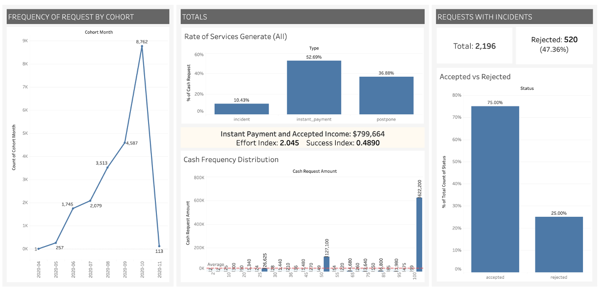

# Data Analysis Project: Tableau Dashboard

## Project Description

This project focuses on data analysis and interactive visualization through a dashboard created in Tableau. The main objective is to present the key findings from the data analysis in a clear and visual manner. This dashboard includes interactive charts and filters that allow users to explore different aspects of the dataset.

---

## Dashboard Preview Image

Below is a preview of the developed dashboard:

---

## Link to the Dashboard File

You can download the dashboard file in Tableau format (.twbx) using the following link:

[Download Dashboard - version #1](Dashboard.twbx)
[Download Dashboard - version #2](Book1.twbx)

---

## Link to the Dashboard on Tableau Public

Explore the dashboard directly on Tableau Public using the following link:

[View Dashboard on Tableau Public](https://public.tableau.com/views/DSMLBootcampProjectI-DemoData/Dashboard1?:language=en-US&publish=yes&:sid=&:redirect=auth&:display_count=n&:origin=viz_share_link)

---

## Conclusion

This dashboard is a powerful tool for understanding and communicating the key findings of data analysis. Thanks to Tableau's interactive capabilities, data scientist can explore and analyze the data from multiple perspectives.
