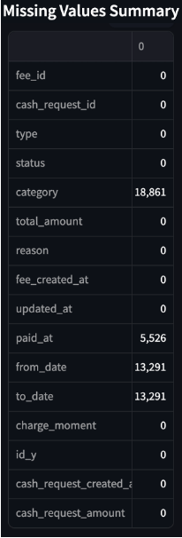
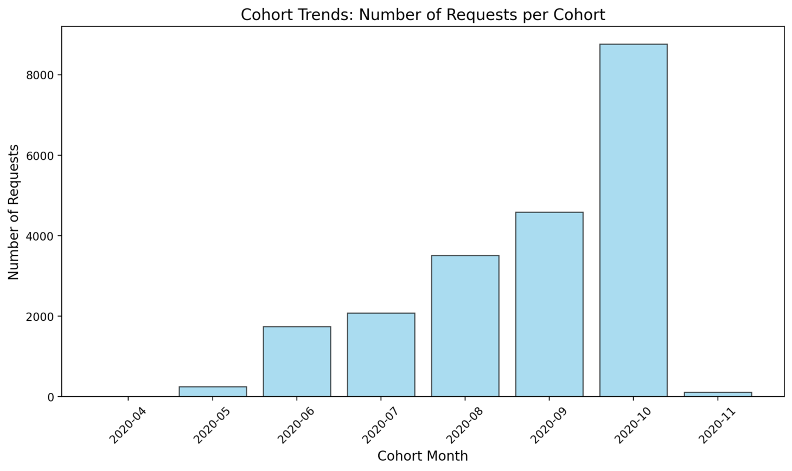

# Descriptive Statistics Analysis

## Data Cleaning and Merging

Rows in fees after excluding non-matching: `21057` from `21060` in the "Fees Dataset" and `23970` in the "Cash Request Dataset".

## Descriptive Statistics

### Missing Values Summary

{width=150px height=70px}

### Amount Request Distribution

### Rows per Cohort

### Incident Rate Analysis

## Conclusion on First Data Analysis

This interactive dashboard provides insights into cohort-based data analysis, incident rates, and data distributions.

#### Results of the Exploratory Data Analysis (EDA)

**Descriptive Statistics:**

- The average request amount is $81.83, ranging from $1 to $200.
- There seems to be a possibility that more effort than necessary is being dedicated to transactions.
- The average fee (total_amount) is constant at $5, except for outliers.

**Outliers:**

- Four records in the top 1% of request amounts are considered outliers.

**Distributions and Frequencies:**

- Most requests have amounts close to 50 and 100.
- Variations in the number of requests are observed across cohort months.

**Incident Rate:**

- The analysis revealed variable incident rates by month, indicating possible behavioral patterns.
